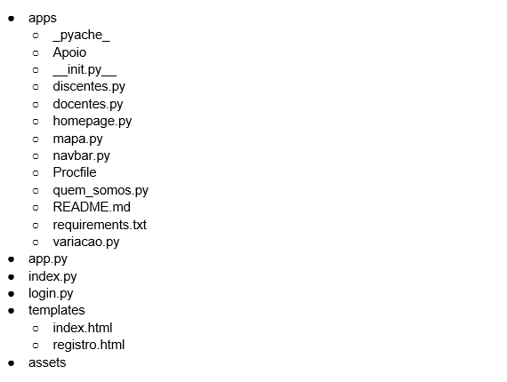
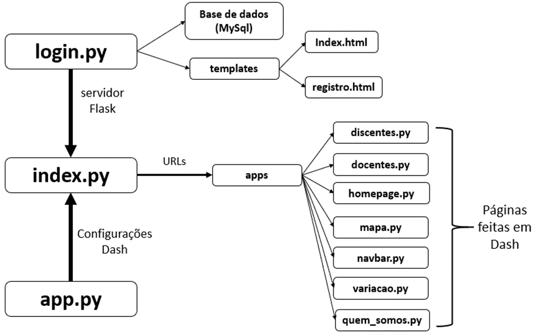
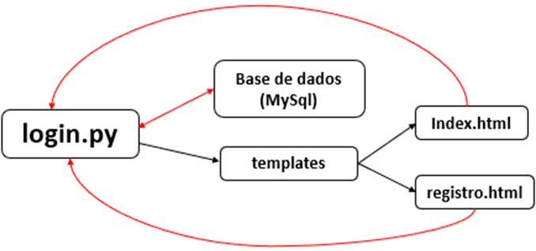
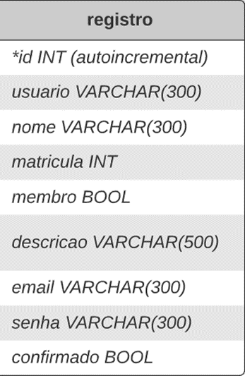

<h1 align="center">Sobre o Funcionamento da Aplicação</h1>

## Sumário

* ### [1) Visão Geral](#intro)

* ### [2) Processo de Login](#commit)
    * #### [Conexão da Aplicação com o Banco de Dados](#metodo1)
    * #### [URLs do site](#metodo2)
    * #### [Processos de registro de novos usuários](#metodo3)
    
* ### [3) Conciserações Finais](#branch-tag)

* ### [Redes Sociais do ODE](#social-media)

## 1) Visão Geral 

Esse relatório apresenta uma visão geral sobre o funcionamento do site do Observatório de Dados da Extensão (ODE), tendo como foco principal a explicação sobre como é feito o processo de login, o qual é apresentado de forma detalhada. Antes de iniciar-se a discussão sobre o login, precisa-se de uma ideia geral sobre como o site é estruturado internamente, que é mostrada abaixo no diagrama 01.

Vale destacaa ainda que existem diversas outras empresas presentes no mercado para utilização do git, como o Bickbucket e o GitLab. Essas empresas basicamente disponibilizam uma pasta na nuvem para que o usuário realize a utilização do git, de forma semelhante ao GitHub. 

Diagrama 01: arquivos e diretórios utilizados para fazer a aplicação do ODE funcionar.
   

 
  

Os três principais arquivos da aplicação do ODE são: o app.py, o index.py e o login.py. O arquivo app.py é o local onde toda a configuração da uma aplicação Dash (framework python utilizado no projeto) é iniciada; o servidor do projeto, no entanto, é importado do arquivo login.py que declara um servidor Flask(biblioteca utilizada para a criação do servidor e gerenciamento das URLs). Porém, o site só é inicializado através do comando server.run() no arquivo index.py - que serve como um arquivo de ligação entre as informações referentes às URLs das páginas feitas em Dash, bem como da inicialização do site através do Login. 
A página do ODE tem como funcionalidade o processo de login para acessar as informações da aplicação, este é feito através do auxílio de 2 templates HTML (index.html para login e registro.html para o registro de novos usuários) que não são feitos em dash mas em HTML, CSS e JavaScript puros, e que são renderizados de acordo com a requisição da URL, tendo as suas informações processadas pelo arquivo login.py, que as obtém através do da requisição de URL em que o site de encontra através de uma chamada(método da biblioteca Flask baseado em JavaScript que fica aguardando determinada condição acontecer para que uma ação seja executada, @app.route(‘/caminho_desejado’) especificamente o método GET, ambos da biblioteca Flask. Um modelo gráfico sobre a estruturação de funcionamento do site do ODE é mostrado abaixo, na figura 01.

Figura 01: Visão geral prática sobre o funcionamento do site do ODE. 

   
## 2) Processo de Login 

O processo de login/cadastro dos usuários é majoritariamente realizado pelo arquivo login.py, que é constituído de três principais partes: (a) a conexão da aplicação com um banco de dados (conexão em nuvem) contendo todas as informações prévias dos usuários cadastrados; (b) os caminhos de URLs referentes a parte do login e (c) o cadastro de novos usuários no site através de uma confirmação via e-mail. Um diagrama geral do processo de login é representado abaixo na figura 02.

Figura 02: Interações da página com o arquivo login.py de forma explícita.

### a)	Conexão da aplicação com o Banco de Dados 
O banco de dados utilizado na aplicação tem conexão em nuvem no server sql10.freesqldatabase.com, utiliza a linguagem SQL, e possui uma capacidade máxima de 5MB, sendo esse server um serviço temporariamente gratuito, servindo para a hospedagem temporária do banco de dados, enquanto o projeto não for internalizado pela UFPB. Vale destacar que os dados contidos nele estão criptografados através de uma chave, utilizando a biblioteca python cryptography. É importante destacar que essa chave é armazenada em uma variável de ambiente chamada key garantindo que ela não possa ser descoberta/roubada através do código. Sendo assim, a criptografia é confiável, garantindo a confidencialidade de todas as informações pessoais dos usuários do site, como dados de e-mail, senha, nome completo, matrícula/siap, etc. Vale destacar ainda que o banco de dados é utilizado apenas para o login/registro de usuários, tendo apenas uma tabela chamada “registro” contendo todas as informações pertinentes de cadastro dos usuários, conforme é mostrado abaixo na figura 03.

Figura 03: Diagrama do banco de dados utilizado para o armazenamento das informações de login.

### b)	URLs do site 
As URLs do site foram mapeadas através de Flask callbacks app.route, que obtêm a URL atual em que o usuário está e a partir dela exerce alguma ação. No caso do login, essa ação é carregar um template html baseado na página, sendo o index.html caso o usuário esteja na raiz(‘/’) ou no caminho de login (‘/login’); por outro lado, se o usuário estiver na URL (‘/registro’) a ação é carregar o template registro.html. É importante destacar que quando o formulário desses templates é submetido, as informações são lidas no arquivo login.py e depois utilizadas para o processo de login, em que há uma comparação com os dados prévios da base de dados(que são descriptografados durante o processo de comparação de informações, como a senha e o nome do usuário, mas apenas em tempo de execução e ,portanto, não acessíveis via código) os quais são contidos em uma variável global durante o código chamada users; já no caso do registro, as informações coletadas são criptografadas e então gravadas.

### c)	URLs do site 
O processo de registro de novos usuários se inicia quando a callback @app.route(‘/registro’) é chamada e exibe na tela o template registro.html. Nesse template, existe um formulário com as informações necessárias para a requisição do cadastro de um novo usuário na plataforma, contendo alguns recursos como dicas para melhorar a senha (feito através de JavaScript). Uma vez que o usuário submete o formulário, o arquivo login.py seleciona o e-mail do usuário e cria um token referente aquele e-mail, posteriormente enviando-o ao e-mail de cadastro do ODE que pode permitir o cadastro daquele usuário através de um link (diferente para cada usuário uma vez que é gerado a partir do token daquele determinado usuário). 

### visite as nossas redes sociais: 

 
 
